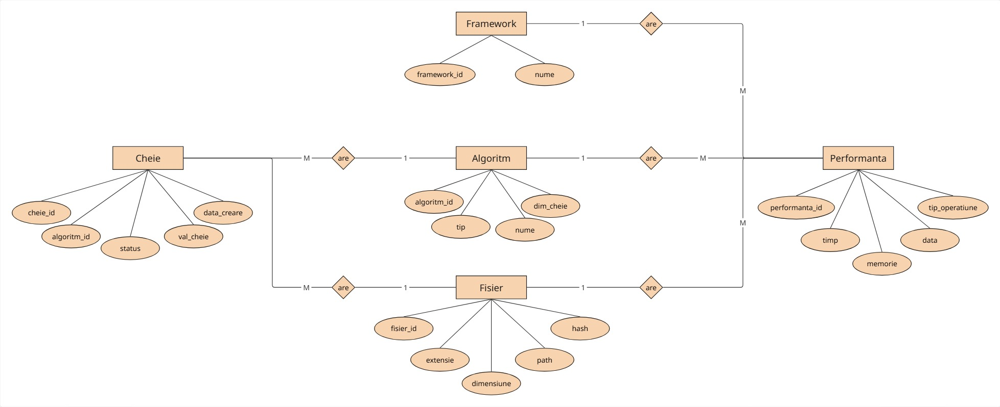

# Sistem de management al cheilor de criptare (Proiect SI)

Proiect dezvoltat de Simiuc Alexandru si Vasilca Rares-Mihai la materia SI

## Tehnologii folosite

* **Backend:** Python 3.11, FastAPI
* **Baza de Date:** MariaDB
* **Containerizare:** Docker & Docker Compose

## Arhitectura si baza de date

Aplicatia foloseste o baza de date relationala:

* **Algoritm:** Stocheaza detalii despre algoritmii suportati (nume, tip, dimensiune cheie).
* **Fisier:** Pastreaza evidenta fisierelor procesate (nume, extensie, dimensiune).
* **Cheie:** Gestioneaza cheile de criptare generate pentru algoritmi.
* **Performanta:** Pastreaza timpul si memoria consumata pentru fiecare operatiune de criptare/decriptare, legand fisierul de algoritmul folosit.
* **Framework:** Stocheaza framework-urile criptografice utilizate (ex: OpenSSL, Custom Python).

## Cum sa rulezi aplicatia local

Aplicatia este complet containerizata.

1. Cloneaza repository-ul local.
2. Deschide un terminal in folderul proiectului.
3. Porneste containerele folosind comanda:
   ```bash
   docker compose up --build
